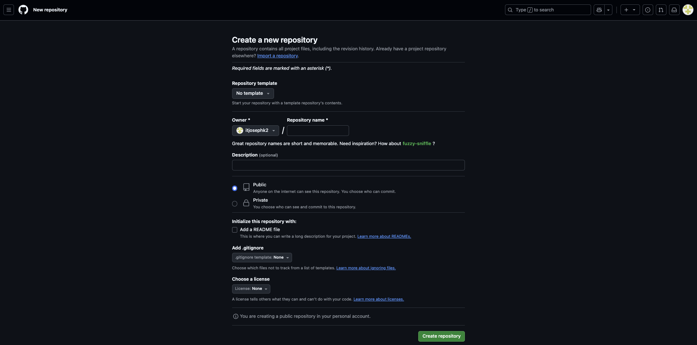

# Task Tracker Backend
 
 This is the backend for the **Task Tracker** project, built using Django and Django REST Framework (DRF). It provides a RESTful API for managing tasks and user authentication.
 
 ---
 
 ## Table of Contents
 
 - [Features](#features)
 - [Technologies Used](#technologies-used)
 - [Installation & Setup](#installation--setup)
 - [API Endpoints](#api-endpoints)
 - [Authentication](#authentication)
 - [Testing](#testing)
   - [Automated Testing](#automated-testing)
   - [Manual Testing](#manual-testing)
 - [Models](#models)
 - [Deployment (Heroku)](#deployment-heroku)
 - [Notes](#notes)
 - [Author](#author)
 
 ---
 
 ## Features
 
 This backend is designed for individual users or small teams to manage their personal or shared task lists. It is suitable for applications where each user needs secure authentication and private task management via a simple API interface.
 
 - User Registration
 - Token-based Authentication (Login)
 - CRUD functionality for tasks (Create, Read, Update, Delete)
 - Authorization: Users can only view and manage their own tasks
 - Deployed to Heroku
 
 ---
 
 ## Technologies Used
 
 - Python 3.13
 - Django 5.1.7
 - Django REST Framework 3.15.2
 - Gunicorn (for Heroku deployment)
 - PostgreSQL (Neon hosted)
 - Heroku for deployment
 
 ---
 
 ## Installation & Setup
 
 1. Clone the repository:
 
 
bash
 git clone https://github.com/itjosephk2/task-tracker-drf.git
 cd task-tracker-drf

 
 2. Create and activate a virtual environment:
 
 
bash
 python -m venv venv
 source venv/bin/activate  # On Windows use `venv\Scripts\activate`

 
 3. Install dependencies:
 
 
bash
 pip install -r requirements.txt

 
 4. Create a .env file in the root directory:
 
 
env
 SECRET_KEY=your-secret-key
 DEBUG=True
 ALLOWED_HOSTS=127.0.0.1,localhost
 database_url=your-postgres-url

 
 5. Run migrations and start the server:
 
 
bash
 python manage.py migrate
 python manage.py runserver

 
 ---
 
 ## API Endpoints
 
 | Method | Endpoint            | Description              |
 |--------|---------------------|--------------------------|
 | POST   | /api/register/      | Register a new user      |
 | POST   | /api/login/         | Login & get auth token   |
 | GET    | /api/tasks/         | List user's tasks        |
 | POST   | /api/tasks/         | Create new task          |
 | GET    | /api/tasks/<id>/    | Retrieve task by ID      |
 | PUT    | /api/tasks/<id>/    | Fully update task        |
 | PATCH  | /api/tasks/<id>/    | Partially update task    |
 | DELETE | /api/tasks/<id>/    | Delete a task            |
 
 ---
 
 ## Authentication
 
 Authentication is handled using **token-based authentication** from Django REST Framework.
 
 ### Login
 - Endpoint: POST /api/login/
 - Request Body:
 
 
json
 {
   "username": "your_username",
   "password": "your_password"
 }

 
 - Response:
 
json
 {
   "token": "your_token_here"
 }

 
 Use this token in the Authorization header for all protected endpoints:
 
 
Authorization: Token your_token_here

 
 ---
 
 ## Testing
 
 ### Automated Testing
 
 Automated tests were implemented using Django’s built-in TestCase framework to ensure that core backend functionality works as intended.
 
 #### Coverage
 
 - **User Authentication**
   - Token-based login authentication tested for validity and security.
 
 - **Task API CRUD Operations**
   - POST /api/tasks/ - Create tasks
   - GET /api/tasks/ - List user tasks
   - GET /api/tasks/<id>/ - Retrieve individual tasks
   - PUT /api/tasks/<id>/ - Fully update tasks
   - PATCH /api/tasks/<id>/ - Partially update tasks
   - DELETE /api/tasks/<id>/ - Delete tasks
 
 - **Permissions**
   - Only authenticated users can access the API.
   - Each user can only access their own tasks.
 
 #### File Location
 
 All test cases are located in:
 
tasks/tests.py

 
 #### Running Tests
 
 To run tests locally:
 
bash
 python manage.py test

 
 ### Manual Testing
 
 Manual testing was conducted using [ReqBin](https://reqbin.com/), a browser-based API testing tool.
 
 #### Example Requests
 
 **Registration**
 
POST /api/register/
 {
   "username": "testuser",
   "email": "test@example.com",
   "password": "secure123"
 }

 
 **Login**
 
POST /api/login/
 {
   "username": "testuser",
   "password": "secure123"
 }

 Response:
 
json
 {"token": "abc123"}

 
 **Create Task**
 
POST /api/tasks/
 Headers: Authorization: Token abc123
 {
   "title": "New Task",
   "description": "Do something important",
   "due_date": "2025-03-30"
 }

 
 **List Tasks**
 
GET /api/tasks/
 Headers: Authorization: Token abc123

 
 **Update Task**
 
PATCH /api/tasks/1/
 Headers: Authorization: Token abc123
 {
   "completed": true
 }

 
 **Delete Task**
 
DELETE /api/tasks/1/
 Headers: Authorization: Token abc123

 
 ---
 
 ## Models
 
 | Field       | Type      | Description                      |
 |-------------|-----------|----------------------------------|
 | id          | Integer   | Auto-incremented primary key     |
 | title       | String    | Title of the task                |
 | description | Text      | Detailed task description        |
 | due_date    | Date      | Due date for the task            |
 | completed   | Boolean   | Task completion status           |
 | created_at  | DateTime  | Timestamp when task was created  |
 | owner       | FK(User)  | Reference to the user who owns it|
 
 ---
 
# Deployment To Heroku

The project was deployed to [Heroku](https://www.heroku.com). The deployment process is as follows:

Firstly we need to create a new repository in [GitHub](https://github.com/) where our project files will be located

- Navigate to [GitHub](https://github.com/)
- Create a new repository with no template



Once you've created your new empty repository, we need to pull this repository down onto our local machine. Throughout the course I have used [VSCode](https://code.visualstudio.com/) to create and manage my projects instead of GitPod so I will be demonstrating the process with [VSCode](https://code.visualstudio.com/).

- Copy either the HTTPS or SSH URL that has just been generated by [GitHub](https://github.com/)


## Cloning and Opening the Task Tracker DRF Repository

Now we need to open up a command prompt to pull this empty repository down onto our machine

- Open a CMD
- CD to a location you wish to store this project
- Now type **git clone https://github.com/MikeR94/drf-api-deployment-process.git**
- After the project has been pulled down onto your local machine, CD to the project and type **code .** to open the project with [VSCode](https://code.visualstudio.com/)

```bash
# Navigate to the Desktop
cd Desktop

# Clone the GitHub repository
git clone https://github.com/itjosephk2/task-tracker-drf.git

# Change into the cloned directory
cd task-tracker-drf

# Open the project in VS Code
code .
``` 

Now it's time to install Django and some additional packages

- Install requirements with pip install -r requirements.txt
- Create our new project by typing **django-admin startproject drf_api_deployment_process .**


Now we need to add our newly installed apps to our **settings.py** file


Next, create a new **env.py** file and paste in the following code.
Back in our **settings.py** file we need to import our **env.py** file if it exists

```Python
import os

SECRET_KEY = os.getenv("DJANGO_SECRET_KEY", "fallback-secret-key")
DEBUG = os.getenv("DEBUG", "False") == "True"

# ALLOWED HOSTS (split comma-separated string into a list)
ALLOWED_HOSTS = os.getenv("ALLOWED_HOSTS", "127.0.0.1").split(",")

if os.getenv("DATABASE_URL"):
    DATABASES['default'] = dj_database_url.config(conn_max_age=600)
```

Now it's time to start creating our applications. For my project I created 1 applications

- **tasks**

Don't forget to add these applications to the INSTALLED_APPS variable in **settings.py**

After you have finished developing your application, you are ready to move onto the next deployment steps

First let's install JSON Web Token Authentication

- In the terminal type **pip install dj-rest-auth**

Add both rest framework’s auth token and django rest auth to INSTALLED APPS -

```Python
INSTALLED_APPS = [
    'django.contrib.admin',
    'django.contrib.auth',
    'django.contrib.contenttypes',
    'django.contrib.sessions',
    'django.contrib.messages',
    'django.contrib.staticfiles',
    # rest
    'rest_framework',
    'rest_framework.authtoken',
    'corsheaders',
    # custom apps
    'tasks',
]
```

Now add the urls to the urlpatterns list **path('dj-rest-auth/', include('dj_rest_auth.urls'))**

```Python
urlpatterns = [
    path('admin/', admin.site.urls),
    path('api/', include('tasks.urls')),
    path('api/login/', obtain_auth_token, name='api_token_auth'),
]
```

Now migrate the database by typing **python manage.py migrate**

Next install Django All Auth with the following command - **pip install 'dj-rest-auth[with_social]'** and add the new application to the INSTALLED_APPS vairable in **settings.py**

```Python
INSTALLED_APPS = [
    "django.contrib.sites",
    "allauth",
    "allauth.account",
    "allauth.socialaccount",
    "dj_rest_auth.registration",
]
```

Now add a SITE_ID variable in **settings.py**

```Python
SITE_ID = 1
```

Add the registration urls to the urlpatterns list

```Python
urlpatterns = [
    path('dj-rest-auth/registration/', include('dj_rest_auth.registration.urls')),
]
```

Now it's time to Add JWT tokens functionality, in the terminal type in the following command **pip install djangorestframework-simplejwt**

In **env.py** add the following variable

```Python
os.environ['DEV'] = '1'
```

In **settings.py** set the DEBUG value equal to the DEV variable you just set in **env.py**

```Python
DEBUG = 'DEV' in os.environ
```

Next, still in **settings.py** add the following code differentiate between development and production modes and also set the pagination and date time format

```Python
REST_PAGINATION = "rest_framework.pagination.PageNumberPagination"

REST_FRAMEWORK = {
    "DEFAULT_AUTHENTICATION_CLASSES": [
        (
            "rest_framework.authentication.SessionAuthentication"
            if "DEV" in os.environ
            else "dj_rest_auth.jwt_auth.JWTCookieAuthentication"
        )
    ],
    "DEFAULT_PAGINATION_CLASS": REST_PAGINATION,
    "PAGE_SIZE": 100,
    "DATETIME_FORMAT": "%d %b %Y",
}
```

And now add the following code to **settings.py** to enable token authentication, cookie declaration and to also ensure that the tokens are sent over HTTPS only

```Python
REST_USE_JWT = True
JWT_AUTH_SECURE = True
JWT_AUTH_COOKIE = "my-app-auth"
JWT_AUTH_REFRESH_COOKIE = "my-refresh-token"
JWT_AUTH_SAMESITE = "None"
```

Now we can create a new root route which will act as a welcome screen to anyone who visits the root route of our API

- Create a new **views.py** file in your main project folder (drf_api_league_hub) and add the following code

```Python
from rest_framework.decorators import api_view
from rest_framework.response import Response


@api_view()
def root_route(request):
    """
    Function to return a welcome message
    upon loading the API
    """
    return Response({"message": "Welcome to the League Hub DRF API!"})
```

Add that new route to the urlpatterns list in the main **urls.py** file

```Python
from .views import root_route

    path("", root_route),
```

Now it's time to create a new production database with [ElephantSQL](https://www.elephantsql.com/)

- Log into [ElephantSQL](https://www.elephantsql.com/)
- Click **Create New Instance**
- Give your plan a name
- Select \*_Tiny Turtle (Free)_ plan
- Click **Select Region** and pick a data center near you
- Click **Review**, double check the information you provided, once happy, click **Create Instance**

We need to get the new database URL from the [ElephantSQL](https://www.elephantsql.com/) dashboard.

Return to the dashboard, find your newly created plan and copy the URL


Back in our local project, in **eny.py** we can add our copied production database URL and store it in a new variable which can be referenced without exposing the value to unwanted eyes

```Python
os.environ.setdefault(
    "DATABASE_URL", "YOUR DB URL HERE",
)
```

In the terminal, type in **pip install dj_database_url**

After that has installed, we need to import it into our main **settings.py** file

```Python
import dj_database_url
```

Now we can seperate the development and production environment databases with the following code

```Python
if "DEV" in os.environ:
    DATABASES = {
        "default": {
            "ENGINE": "django.db.backends.sqlite3",
            "NAME": BASE_DIR / "db.sqlite3",
        }
    }
else:
    DATABASES = {"default": dj_database_url.parse(
        os.environ.get("DATABASE_URL"))}
    print("Connected to live database")
```

Next we need to install gunicorn. In the terminal, type in the following

- **pip install gunicorn**

Now created a Procfile at the root level in your project


Within that newly created Procfile, add the following code to let Heroku know how to run the project

```Python
release: python manage.py makemigrations && python manage.py migrate
web: gunicorn drf_api_league_hub.wsgi
```

Back in **settings.py**, we need to tell the project which hosts to allow

```Python
ALLOWED_HOSTS = [
    os.environ.get("ALLOWED_HOST"),
    "127.0.0.1",
]
```

Add it to the MIDDLEWARE list - it is important that it is placed at the top of the list

```Python
MIDDLEWARE = [
    "corsheaders.middleware.CorsMiddleware",
]
```

Now we need to set the ALLOWED_ORIGINS for the network requests made to the server. In **settings.py** file, add the below

```Python
if "CLIENT_ORIGIN" in os.environ:
    CORS_ALLOWED_ORIGINS = [
        os.environ.get("CLIENT_ORIGIN"),
    ]
if "CLIENT_ORIGIN_DEV" in os.environ:
    CORS_ALLOWED_ORIGINS.append(os.environ.get("CLIENT_ORIGIN_DEV"))

CORS_ALLOW_CREDENTIALS = True

JWT_AUTH_SAMESITE = 'None'
```

Now we need to replace the SECRET_KEY variable in **settings.py** to reference the secret key that we will create in **env.py**

In **env.py** create a new variable called SECRET_KEY and give it a value

```Python
os.environ.setdefault("SECRET_KEY", "YOUR SECRET KEY HERE")
```

Now back in **settings.py**, change the SECRET_KEY value to point to the SECRET_KEY you just created in **env.py**

```Python
SECRET_KEY = os.getenv("SECRET_KEY")
```

Update the requirements file by typing in the command in the terminal **pip freeze > requirements.txt**

- git add
- git commit -m "{message here}
- git push

Now it's time to deploy our new project live for everyone to see on [Heroku](https://www.heroku.com)

- Navigate to [Heroku](https://www.heroku.com)
- Click **New app**
- Fill in the relevant information
- Click **Create app** once you are happy


Once you've created your new [Heroku](https://www.heroku.com) application, we need to add some config variables. Click the **settings** tab and then click **Reveal Config Vars**

Make sure to add the following config variables

- ALLOWED_HOST - This is the URL of your deployed project (without the https)
- CLIENT_ORIGIN - This is the URL of your deployed front-end project
- CLIENT_ORIGIN_DEV - This is the URL when developing locally
- CLOUDINARY_URL - This is your Cloudinary API key
- DATABASE_URL - This is your production database URL
- DISABLE_COLLECTSTATIC - This will be removed before submission
- SECRET_KEY - This is the secret key you have created


Now we need to link our [Heroku](https://www.heroku.com) application with our [GitHub](https://github.com/) project

- Click the **Deploy** tab
- Choose **GitHub**
- Search for your repository
- Once found, click **Connect**


Finally, we can deploy our connected projected for everyone to see.

You can either choose **Enable Automatic Deploys** or **Deploy Branch**. I chose to deploy my application manually when I was ready instead of automatic deployments

- Click **Deploy Branch** and wait for it to build


[Back to top](#contents)


 
 ---
 
 ## Notes
 
 - Replace all placeholders with your actual secret keys, database URLs, and app name.
 - This backend is designed to work seamlessly with a React frontend.
 
 ---
 
 ## Author
 
 Built with care by Joseph Keane, 2025.
